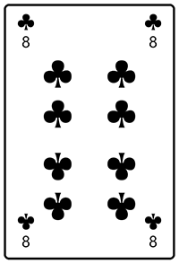
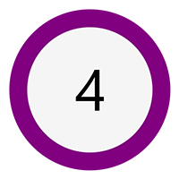

# Comentsys.Toolkit.WindowsAppSdk

**Comentsys.Toolkit.WindowsAppSdk** is a **Toolkit** with **Controls**, **Converters**, **Extensions** and **Widget** functionality for **Windows App SDK** and uses **Comentsys.Toolkit**.

## Change Log

### Version 2.2.0

- Update WidgetBase and WidgetProviderBase for IsConfigure and IsActivated Properties along with optional Context Property

### Version 2.1.0

- Add CreateWidget, DeleteWidget and OnCustomizationRequested for Widget Functionality

### Version 2.0.0

- Update for .NET 8, Add SystemDrawingToWindowsColorConverter, Directional Pad, Directional Stick and Widget Functionality

### Version 1.0.1

- Fixed Piece and Sector Dependency Properties

### Version 1.0.0

- Initial Release

## Asset

`Asset` can be used to represent an `AssetResource` visually which can be set with the **Property** for `AssetResource` in a **Windows App SDK** based Application.

### AssetResource

Asset Resource

### Example


> Example using `AssetResource` from `ShadedFluentEmoji.Get(FluentEmojiType.GrinningFace)` in **Package** of `Comentsys.Assets.FluentEmoji`.

## Card

`Card` will display a **Playing Card** for card-based games such as **Blackjack**, **Poker** and more. You can customise the `Back` of a `Card` using any `Brush` and can set the `Value` from *0* which will display the `Back` to between *1* and *52* to represent each **Suit** and **Card**.

### Back

Card Back

### Value

Card Value

### Example



## Dialog

`Dialog` makes it easy work with `ContentDialog` and avoid pitfalls and common errors when using them supporting both **Confirmation** and just **Showing** any **Dialogs**.

### Constructor(root, title)

Constructor

| Name | Description |
| ---- | ----------- |
| `root` | `Microsoft.UI.Xaml.XamlRoot`<br>Xaml Root |
| `title` | `System.String?`<br>Title |

### ConfirmAsync(content, primaryButtonText, secondaryButtonText, title)

Confirm

| Name | Description |
| ---- | ----------- |
| `content` | *`System.Object`*<br>Content |
| `primaryButtonText` | `System.String`<br>Primary Button Text |
| `secondaryButtonText` | `System.String`<br>Secondary Button Text |
| `title?` | `System.String`<br>Override Title |

#### Returns

True if Primary Button Selected False if not

### ConfirmAsync(content, primaryButtonText, secondaryButtonText, title)

Confirm

| Name | Description |
| ---- | ----------- |
| `content` | `System.String`<br>Content |
| `primaryButtonText` | `System.String`<br>Primary Button Text |
| `secondaryButtonText` | `System.String`<br>Secondary Button Text |
| `title` | `System.String?`<br>Override Title |

#### Returns

True if Primary Button Selected False if not

### Show(content, primaryButtonText, title)

Show

| Name | Description |
| ---- | ----------- |
| `content` | `System.Object`<br>Content |
| `primaryButtonText` | `System.String`<br>Primary Button Text |
| `title` | `System.String`<br>Override Title |

### Show(content, primaryButtonText, title)

Show

| Name | Description |
| ---- | ----------- |
| `content` | `System.String`<br>Content |
| `primaryButtonText` | *System.String*<br>Primary Button Text |
| `title` | `System.String`<br>Override Title |

### ShowAsync(content, primaryButtonText, title)

Show

| Name | Description |
| ---- | ----------- |
| content | *System.Object*<br>Content |
| primaryButtonText | *System.String*<br>Primary Button Text |
| title | *System.String*<br>Override Title |

### ShowAsync(content, primaryButtonText, title)

Show

| Name | Description |
| ---- | ----------- |
| content | *System.String*<br>Content |
| primaryButtonText | *System.String*<br>Primary Button Text |
| title | *System.String*<br>Override Title |

## Dice

`Dice` can display values by seting the `Value` from *0* to display no value to between *1* and *6* to represent the **Face** a **Dice** or **Die**. You can customise the `Foreground` of a `Dice` using any `Brush` which will change the **Colour** of the **Pips** use on the **Face** of the **Dice**.

### Foreground

Dice Foreground

### Value

Dice Value

### Example


## DirectionalPad

`DirectionalPad` can be used for selecting a `Direction` of `Up`, `Down`, `Left` and `Right`
for use as a **Directional Pad**. You can customise the `Foreground` of a `DirectionalPad` using any `Brush`.

### Direction

Direction

### Foreground

Foreground

### ValueChanged

Value Changed Event

### Example


## DirectionalPadDirection

Directional Pad Direction

### Down

Down Pad

### Left

Left Pad

### Right

Right Pad

### Up

Up Pad

## DirectionalPadEventArgs

Directional Pad Event Args

| Name | Description |
| ---- | ----------- |
| direction | *Comentsys.Toolkit.WindowsAppSdk.DirectionalPadDirection*<br>Directional Pad Direction |

### Direction

Direction

## DirectionalStick

`DirectionalStick` can be used for selecting a `Direction` of `Up`, `Down`, `Left` and `Right`
for use as a **Directional Pad**. You can customise the `Foreground` of a `DirectionalStick` using any `Brush` which will change the **Centre** of the `DirectionalStick` and `Fill` which will change the area around the **Centre** of the `DirectionalStick`

### Angle

Angle

### Fill

Fill

### Foreground

Foreground

### Radius

Radius

### Ratio

Ratio

### Sensitivity

Sensitivity

### ValueChanged

Value Changed Event

### Example


## DirectionalStickEventArgs

Directional Stick Event Args

### Angle

Stick Angle around Centre

### Ratio

Stick Ratio from Centre

## Piece

`Piece` can be used to represent items in **Games** in either a **Square** or **Circle** and can contain a `Value` which can be a short `string`, the outline or `Stroke` can be set, along with the `Foreground` for the `Value` and the `Fill` of the `Piece`.

### Fill

Piece Fill

### Foreground

Piece Foreground

### IsSquare

Piece Is Square?

### Stroke

Piece Stroke

### Value

Piece Value

### Example



## Sector

`Sector` can be used to represent a portion or **Arc** section of a **Circle** as needed. The `Start` and `Finish` position of the `Sector` can be set, along with the `Radius` and `Hole` which allows for a variety of combinations for display, it also supports all the values of a `Path` for a `Shape`.

### Finish

Sector Finish

### Hole

Sector Hole

### Radius

Sector Radius

### Start

Sector Start

### Example


## BoolToVisibilityConverter

`BoolToVisibilityConverter` implements the **Interface** for `IValueConverter` and supports conversion of an `object` to a `bool` for use with **Binding**. 

### Convert(value, targetType, parameter, language)

Convert

| Name | Description |
| ---- | ----------- |
| `value` | `System.Object`<br>Bool Value |
| `targetType` | `System.Type`<br>Target Type |
| `parameter` | `System.Object`<br>Parameter |
| `language` | `System.String`<br>Language |

#### Returns

Visiblity

### ConvertBack(value, targetType, parameter, language)

Convert Back

| Name | Description |
| ---- | ----------- |
| `value` | `System.Object`<br>Value |
| `targetType` | `System.Type`<br>Target Type |
| `parameter` | `System.Object`<br>Parameter |
| `language` | `System.String`<br>Language |

*System.NotImplementedException:* 

## StringFormatConverter

`StringFormatConverter` implements the **Interface** for `IValueConverter` and supports **Formatting** of an `object` that is a `string` for use with **Binding**.

### Convert(value, targetType, parameter, language)

Convert

| Name | Description |
| ---- | ----------- |
| `value` | `System.Object`<br>Bool Value |
| `targetType` | `System.Type`<br>Target Type |
| `parameter` | `System.Object`<br>String Format |
| `language` | `System.String`<br>Language |

#### Returns

Formatted String

### ConvertBack(value, targetType, parameter, language)

Convert Back

| Name | Description |
| ---- | ----------- |
| `value` | `System.Object`<br>Bool Value |
| `targetType` | `System.Type`<br>Target Type |
| `parameter` | `System.Object`<br>String Format |
| `language` | `System.String`<br>Language |

*System.NotImplementedException:* 

## SystemDrawingToWindowsColorConverter

System Drawing to Windows Color Converter

### Convert(value, targetType, parameter, language)

Convert

| Name | Description |
| ---- | ----------- |
| value | *System.Object*<br>Source |
| targetType | *System.Type*<br>Target Type |
| parameter | *System.Object*<br>Parameter |
| language | *System.String*<br>Language |

#### Returns

Target

### ConvertBack(value, targetType, parameter, language)

Convert Back

| Name | Description |
| ---- | ----------- |
| value | *System.Object*<br>Source |
| targetType | *System.Type*<br>Target Type |
| parameter | *System.Object*<br>Parameter |
| language | *System.String*<br>Language |

#### Returns

Target

*System.NotImplementedException:* 

## Extensions

**Comentsys.Toolkit.WindowsAppSdk** contains some useful **Methods** to **Extend** behaviour including **Converting** to or from a **Windows Colour** to a **Drawing Colour** and one for `AssetResource` to get an `ImageSource` for an **Asset Resource**.

### AsDrawingColor(color)

As Drawing Color

| Name | Description |
| ---- | ----------- |
| color | `Windows.UI.Color`<br>Windows Color |

#### Returns

Drawing Color

### AsImageSourceAsync(assetResource)

As Image Source

| Name | Description |
| ---- | ----------- |
| `assetResource` | `Comentsys.Toolkit.AssetResource`<br>Asset Resource |

#### Returns

Image Source

### AsWindowsColor(color)

As Windows Color

| Name | Description |
| ---- | ----------- |
| `color` | `System.Drawing.Color`<br>Drawing Color |

## Widgets

**Widgets** can be provided with a **Widget Provider** from `WidgetProviderBase` such as follows:

```csharp
[Guid("a533b393-3701-41f1-a7e2-833f2548ffe2")]
internal class WidgetProvider : WidgetProviderBase { }
```

The `Guid` needs to be unique and match that provided in the `Package.appxmanifest` file in the section of `com:Class` for `Id` and section of `WidgetProvider` for `CreateInstance`.

A **Widget** can be implemented from `WidgetBase` and `override` the **Methods** of `OnActionInvoked`, `GetTemplateForWidget` and `GetDataForWidget` where needed such as follows:

```csharp
public class CountingWidget : WidgetBase
{
    public static string DefinitionId { get; } = nameof(CountingWidget);

    public override void OnActionInvoked(WidgetActionInvokedArgs actionInvokedArgs)
    {
        // ...
    }

    public override string GetTemplateForWidget()
    {
        // ..
    }

    public override string GetDataForWidget()
    {
        // ..
    }
}
```

You can then setup the **Widget** and **Register** the **Widget Provider** as follows:

```csharp
ComWrappersSupport.InitializeComWrappers();
WidgetProvider.AddWidget(CountingWidget.DefinitionId, (widgetId, initialState, widgetContext) =>
    new CountingWidget(widgetId, initialState, widgetContext));
using var manager = RegistrationManager<WidgetProvider>.RegisterProvider();
var widgets = WidgetManager.GetDefault().GetWidgetIds();
```

This **Library** wraps **Classes** and **Methods** developed by **Microsoft** for **Widgets** such as `ClassObject`, `Guids`, `IClassFactory`, `RegistrationManager`, `WidgetProviderFactory`, `WidgetBase`, `WidgetProviderBase` along with `WidgetHelper`. 

You can find out more about creating **Widget** with a **Counting.Widget** example at [github.com/Comentsys/Comentsys.Toolkit.WindowsAppSdk](https://github.com/Comentsys/Comentsys.Toolkit.WindowsAppSdk) or for more information about implementing **Windows 11 Widgets** including what is needed in a `Package.appxmanifest` at [aka.ms/widgetdevdocs](https://aka.ms/widgetdevdocs).

# WidgetBase

Widget Base

### Constructor(widgetId, initialState, widgetContext)

Widget Base

| Name | Description |
| ---- | ----------- |
| widgetId | *System.String*<br>Widget Id |
| initialState | *System.String*<br>Initial State |
| widgetContext | *Microsoft.Windows.Widgets.Providers.WidgetContext*<br>Widget Context |

### Activate

Activate Widget

## Context

Widget Context

### CreateWidget(state)

Create Widget

| Name | Description |
| ---- | ----------- |
| state | *System.String*<br>State |

### Deactivate

Deactivate Widget

### DeleteWidget(state)

Delete Widget

| Name | Description |
| ---- | ----------- |
| state | *System.String*<br>State |

### GetDataForWidget

Get Data for Widget

#### Returns

Widget Data

### GetTemplateForWidget

Get Template for Widget

#### Returns

Widget Template

### Id

Id

### IsConfigure

Is Configure?

### IsActivated

Is Activated?

### OnActionInvoked(actionInvokedArgs)

Widget On Action Invoked

| Name | Description |
| ---- | ----------- |
| actionInvokedArgs | *Microsoft.Windows.Widgets.Providers.WidgetActionInvokedArgs*<br>Widget Action Invoked Args |

### OnCustomizationRequested(customizationRequestedArgs)

On Widget Customization Requested

| Name | Description |
| ---- | ----------- |
| customizationRequestedArgs | *Microsoft.Windows.Widgets.Providers.WidgetCustomizationRequestedArgs*<br>Customization Requested Args |

### OnWidgetContextChanged(contextChangedArgs)

On Widget Context Changed

| Name | Description |
| ---- | ----------- |
| contextChangedArgs | *Microsoft.Windows.Widgets.Providers.WidgetContextChangedArgs*<br>Context Changed Args |

### SetIsActivated(isActivated)

Set Is Activated

| Name | Description |
| ---- | ----------- |
| isActivated | *System.Boolean*<br>Is Activated |

### SetState(state)

Set State

| Name | Description |
| ---- | ----------- |
| state | *System.String*<br>State |

### State

State

## IWidget

Widget

### Activate

Activate Widget

## Context

Widget Context

### CreateWidget(state)

Create Widget

| Name | Description |
| ---- | ----------- |
| state | *System.String*<br>State |

### Deactivate

Deactivate Widget

### DeleteWidget(state)

Delete Widget

| Name | Description |
| ---- | ----------- |
| state | *System.String*<br>State |

### GetDataForWidget

Get Data for Widget

#### Returns

Widget Data

### GetTemplateForWidget

Get Template for Widget

#### Returns

Widget Template

### Id

Id

### IsActivated

Is Activated?

### IsConfigure

Is Configure?

### OnActionInvoked(actionInvokedArgs)

Widget On Action Invoked

| Name | Description |
| ---- | ----------- |
| actionInvokedArgs | *Microsoft.Windows.Widgets.Providers.WidgetActionInvokedArgs*<br>Widget Action Invoked Args |

### OnCustomizationRequested(customizationRequestedArgs)

On Widget Customization Requested

| Name | Description |
| ---- | ----------- |
| customizationRequestedArgs | *Microsoft.Windows.Widgets.Providers.WidgetCustomizationRequestedArgs*<br>Customization Requested Args |

### OnWidgetContextChanged(contextChangedArgs)

On Widget Context Changed

| Name | Description |
| ---- | ----------- |
| contextChangedArgs | *Microsoft.Windows.Widgets.Providers.WidgetContextChangedArgs*<br>Context Changed Args |

### SetIsActivated(isActivated)

Set Is Activated

| Name | Description |
| ---- | ----------- |
| isActivated | *System.Boolean*<br>Is Activated |

### SetState(state)

Set State

| Name | Description |
| ---- | ----------- |
| state | *System.String*<br>State |

### State

State

## WidgetHelper

Widget Helper

### ReadJsonFromPackage(packageUri)

Read Json from Package

| Name | Description |
| ---- | ----------- |
| packageUri | *System.String*<br>Package Uri |

#### Returns

Json

## WidgetProviderBase

Widget Provider

### Constructor

Constructor

### Activate(widgetContext)

Activate Widget

| Name | Description |
| ---- | ----------- |
| widgetContext | *Microsoft.Windows.Widgets.Providers.WidgetContext*<br>Widget Context |

### AddWidget(widgetId, widgetCreateDelegate)

Add Widget

| Name | Description |
| ---- | ----------- |
| widgetId | *System.String*<br>Widget Id |
| widgetCreateDelegate | *WidgetCreateDelegate*<br>Widget Create Delegate |

### AddWidget(widgetId, widgetDefaultCreateDelegate)

Add Widget

| Name | Description |
| ---- | ----------- |
| widgetId | *System.String*<br>Widget Id |
| widgetDefaultCreateDelegate | *WidgetDefaultCreateDelegate*<br>Widget Default Create Delegate |

### ClearWidgets

Clear Widgets

### CreateWidget(widgetContext)

Create Widget

| Name | Description |
| ---- | ----------- |
| widgetContext | *Microsoft.Windows.Widgets.Providers.WidgetContext*<br>Widget Context |

*InvalidWidgetDefinitionException:* Invalid Widget Definition

### Deactivate(widgetId)

Deactivate Widget

| Name | Description |
| ---- | ----------- |
| widgetId | *System.String*<br>Widget Id |

### DeleteWidget(widgetId, customState)

Delete Widget

| Name | Description |
| ---- | ----------- |
| widgetId | *System.String*<br>Widget Id |
| customState | *System.String*<br>Custom State |

### FindWidget(widgetId)

Find Widget

| Name | Description |
| ---- | ----------- |
| widgetId | *System.String*<br>Widget Id |

#### Returns

Widget

### OnActionInvoked(actionInvokedArgs)

Widget On Action Invoked

| Name | Description |
| ---- | ----------- |
| actionInvokedArgs | *Microsoft.Windows.Widgets.Providers.WidgetActionInvokedArgs*<br>Action Invoked Args |

### OnCustomizationRequested(customizationRequestedArgs)

On Widget Customization Requested

| Name | Description |
| ---- | ----------- |
| customizationRequestedArgs | *Microsoft.Windows.Widgets.Providers.WidgetCustomizationRequestedArgs*<br>Customization Requested Args |

### OnWidgetContextChanged(contextChangedArgs)

On Widget Context Changed

| Name | Description |
| ---- | ----------- |
| contextChangedArgs | *Microsoft.Windows.Widgets.Providers.WidgetContextChangedArgs*<br>Context Changed Args |

### RecoverRunningWidgets

Recover Running Widgets

### UpdateWidget(widgetId, customState)

Update Widget

| Name | Description |
| ---- | ----------- |
| widgetId | *System.String*<br>Widget Id |
| customState | *System.String*<br>Custom State |

#### Returns

True if Updated, False if Not

## WidgetRegistrationManager

Widget Registration Manager

#### Type Parameters

- TWidgetProvider - Widget Provider

### Dispose

Dispose

### Dispose

Disposed

### Dispose(disposing)

Dispose

| Name | Description |
| ---- | ----------- |
| disposing | *System.Boolean*<br>Is Disposing |

### Finalize

Destructor

### GetDisposedEvent

Get Disposed Event

#### Returns

Disposable

### RegisterClass(clsid, factory)

Register Class

| Name | Description |
| ---- | ----------- |
| clsid | *System.Guid*<br>Class Id |
| factory | *Comentsys.Toolkit.WindowsAppSdk.IClassFactory*<br>Class Factory |

#### Returns

Disposable

### RegisterProvider

Register Provider

#### Returns

Registration Manager of Widget Provider

## WidgetCreateDelegate

Widget Create Delegate

| Name | Description |
| ---- | ----------- |
| widgetId | *System.String*<br>Widget Id |
| initialState | *System.String*<br>Initial State |
| widgetContext | *Microsoft.Windows.Widgets.Providers.WidgetContext*<br>Widget Context |

#### Returns

Widget Base

## WidgetDefaultCreateDelegate

Widget Default Create Delegate

| Name | Description |
| ---- | ----------- |
| widgetId | *System.String*<br>Widget Id |
| initialState | *System.String*<br>Initial State |

#### Returns

Widget Base

## InvalidWidgetDefinitionException

Invalid Widget Definition Exception

| Name | Description |
| ---- | ----------- |
| definitionId | *System.String*<br>Definition Id |

### Constructor(definitionId)

Invalid Widget Definition Exception

| Name | Description |
| ---- | ----------- |
| definitionId | *System.String*<br>Definition Id |

### DefinitionId

Definition Id

## Licences

```
MIT License

Copyright (c) Comentsys

Permission is hereby granted, free of charge, to any person obtaining a copy of this software and associated documentation files (the "Software"), to deal in the Software without restriction, including without limitation the rights to use, copy, modify, merge, publish, distribute, sublicense, and/or sell copies of the Software, and to permit persons to whom the Software is furnished to do so, subject to the following conditions:

The above copyright notice and this permission notice shall be included in all copies or substantial portions of the Software.

THE SOFTWARE IS PROVIDED "AS IS", WITHOUT WARRANTY OF ANY KIND, EXPRESS OR IMPLIED, INCLUDING BUT NOT LIMITED TO THE WARRANTIES OF MERCHANTABILITY, FITNESS FOR A PARTICULAR PURPOSE AND NONINFRINGEMENT. IN NO EVENT SHALL THE AUTHORS OR COPYRIGHT HOLDERS BE LIABLE FOR ANY CLAIM, DAMAGES OR OTHER LIABILITY, WHETHER IN AN ACTION OF CONTRACT, TORT OR OTHERWISE, ARISING FROM, OUT OF OR IN CONNECTION WITH THE SOFTWARE OR THE USE OR OTHER DEALINGS IN THE
SOFTWARE.
```

```
MIT License

Copyright (c) Microsoft Corporation.

Permission is hereby granted, free of charge, to any person obtaining a copy of this software and associated documentation files (the "Software"), to deal in the Software without restriction, including without limitation the rights to use, copy, modify, merge, publish, distribute, sublicense, and/or sell copies of the Software, and to permit persons to whom the Software is furnished to do so, subject to the following conditions:

The above copyright notice and this permission notice shall be included in all copies or substantial portions of the Software.

THE SOFTWARE IS PROVIDED "AS IS", WITHOUT WARRANTY OF ANY KIND, EXPRESS OR IMPLIED, INCLUDING BUT NOT LIMITED TO THE WARRANTIES OF MERCHANTABILITY, FITNESS FOR A PARTICULAR PURPOSE AND NONINFRINGEMENT. IN NO EVENT SHALL THE AUTHORS OR COPYRIGHT HOLDERS BE LIABLE FOR ANY CLAIM, DAMAGES OR OTHER LIABILITY, WHETHER IN AN ACTION OF CONTRACT, TORT OR OTHERWISE, ARISING FROM, OUT OF OR IN CONNECTION WITH THE SOFTWARE OR THE USE OR OTHER DEALINGS IN THE SOFTWARE
```